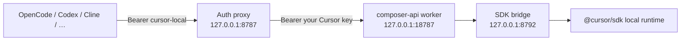

# API for Cursor (Windows)

[](https://github.com/AppleLamps/cursor-api)

Electron tray app that exposes a **local OpenAI-compatible API** for [Cursor Composer](https://cursor.com) on Windows — the same idea as the official [API for Cursor](https://api-for-cursor.standardagents.ai/) macOS app.

Use Composer from OpenCode, Codex, Cline, VS Code, or any client that speaks the OpenAI API, while agents keep running tools against your real project files on disk.

## Motivation

[API for Cursor](https://api-for-cursor.standardagents.ai/) ships as a **macOS** menu-bar app that runs [composer-api](https://github.com/standardagents/composer-api) locally and wires OpenCode, Codex, Cline, and similar harnesses to Cursor Composer. This repository is the **Windows equivalent**: an **Electron** tray app that vendors the same upstream worker, adds Windows-specific agent installers, and documents the dev stack (auth proxy → Vite worker → SDK bridge). It is not affiliated with Cursor or Standard Agents.

For AI assistants: read [AGENTS.md](AGENTS.md) first, then [docs/roadmap.md](docs/roadmap.md). Upstream code lives under `vendor/composer-api` (pinned commit in [vendor/PINNED_COMMIT](vendor/PINNED_COMMIT)).

## How it works



| Layer | What it does |
|--------|----------------|
| **Electron app** | Tray UI, stores your API key, starts/stops services, one-click agent setup |
| **Auth proxy** | Public `/v1` URL; rewrites placeholder tokens to your real Cursor API key |
| **Worker** | OpenAI-compatible routes from [standardagents/composer-api](https://github.com/standardagents/composer-api) |
| **SDK bridge** | Runs Cursor agents locally via `@cursor/sdk` |

Upstream logic lives in `vendor/composer-api` (MIT). This repo adds the Windows shell and Windows-specific agent installers.

## Requirements

- **Windows 10 or 11**
- **[Node.js](https://nodejs.org/) 20+** (for development; a packaged `.exe` is not shipped yet)
- **Cursor account** with an API key from [Cursor Dashboard → Integrations](https://cursor.com/dashboard?tab=integrations)

## Quick start

### 1. Clone and install

```bash
git clone https://github.com/AppleLamps/cursor-api.git cursor-api
cd cursor-api
npm install
npm run vendor:prepare
```

`vendor/composer-api` is included in this repo (with Windows dev patches). To refresh from upstream only, see [docs/vendor.md](docs/vendor.md).

`vendor:prepare` applies local D1 migrations for the Cloudflare worker dev server.

### 2. Run the app

```bash
npm run dev
```

Or build once, then start:

```bash
npm run build
npm start
```

### 3. Configure in the dashboard

1. Paste your **Cursor API key** and click **Save** (stored with Windows DPAPI when available).
2. Click **Start server** and wait until status shows **Ready**.
3. Use **Install** on each harness you use (OpenCode, Codex, VS Code, Cline, Kilo Code, pi).

The tray icon stays in the notification area; double-click or use **Open dashboard** from the tray menu.

## API endpoints

Default base URL (ports may shift if already in use — check the dashboard):

| Resource | URL |
|----------|-----|
| Base | `http://127.0.0.1:8787/v1` |
| Models | `http://127.0.0.1:8787/v1/models` |
| Chat | `http://127.0.0.1:8787/v1/chat/completions` |
| Responses | `http://127.0.0.1:8787/v1/responses` |

### Example: curl

Harnesses can use the placeholder key `cursor-local`; the app substitutes your saved key.

```bash
curl http://127.0.0.1:8787/v1/models ^
  -H "Authorization: Bearer cursor-local"
```

```bash
curl http://127.0.0.1:8787/v1/chat/completions ^
  -H "Authorization: Bearer cursor-local" ^
  -H "Content-Type: application/json" ^
  -d "{\"model\":\"composer-2.5\",\"messages\":[{\"role\":\"user\",\"content\":\"Hello\"}]}"
```

### Example: OpenAI SDK (Node)

```ts
import OpenAI from "openai";

const client = new OpenAI({
  apiKey: "cursor-local",
  baseURL: "http://127.0.0.1:8787/v1"
});

const completion = await client.chat.completions.create({
  model: "composer-2.5",
  messages: [{ role: "user", content: "Explain this repo." }]
});
```

### Placeholder API keys

These Bearer values are rewritten to your stored Cursor key:

- `cursor-local`
- `cursor_api_key` / `cursor-api-key`
- `{env:cursor_api_key}` / `{env:cursor-api-key}`

You can also send your real `cr_…` key directly in `Authorization: Bearer …`.

## Supported models (local catalog)

Typical IDs exposed at `/v1/models` include:

- `composer-2.5` — main Composer model
- `composer-2.5-fast` — faster variant
- `default` / `composer-latest` — aliases resolved by the worker

See the dashboard logs or `GET /v1/models` for the full list your worker returns.

## Agent integrations

One-click **Install** writes provider config pointing at your local base URL. Details and manual setup: [docs/integrations.md](docs/integrations.md).

| Agent | Config touched (approx.) |
|--------|---------------------------|
| OpenCode | `%USERPROFILE%\.config\opencode\opencode.json` |
| Codex | `%USERPROFILE%\.codex\config.toml` + profiles |
| VS Code / Cursor / Windsurf | `%APPDATA%\…\User\chatLanguageModels.json` |
| Cline | `%USERPROFILE%\.cline\data\` |
| Kilo Code | `%USERPROFILE%\.config\kilo\kilo.jsonc` |
| pi | `%USERPROFILE%\.pi\agent\models.json` |

Configs are **backed up** before overwrite (`*.api-for-cursor-backup.<timestamp>` next to the original file).

## Compatibility limits

Inherited from upstream composer-api (see [vendor README](vendor/composer-api/README.md)):

- Text and image input, streaming and non-streaming responses
- **Not supported:** `n` > 1, logprobs, audio output, OpenAI Responses API `tools` / background jobs
- Token `usage` is **estimated** (not exact Cursor billing numbers)
- **Codex** using the Responses API with tool loops may hit `tools` unsupported errors — prefer Chat Completions or check upstream issues

Use of your Cursor API key is subject to [Cursor’s terms](https://cursor.com/terms). This project is not affiliated with Cursor.

## Configuration files

| File | Purpose |
|------|---------|
| `%USERPROFILE%\.api-for-cursor\settings.json` | App settings and encrypted API key |
| `vendor/composer-api/.dev.vars` | Generated on each server start (bridge URL/token) |

Default ports: public **8787**, worker **18787**, bridge **8792**. If busy, the app picks the next free port and saves the new values.

## Project layout

```text
cursor-api/
  electron/           # Tray app (TypeScript → dist/)
    main.ts           # Electron entry, IPC, tray
    server-controller.ts
    auth-proxy.ts
    provisioner.ts    # Agent setup
    renderer/         # Dashboard UI
  vendor/composer-api/  # Upstream worker + SDK bridge (git clone)
  docs/               # Extended documentation
  vendor/PINNED_COMMIT  # Upstream composer-api base SHA (before local patches)
```

## Documentation

- [AGENTS.md](AGENTS.md) — context for coding agents (start here)
- [Agent integrations](docs/integrations.md) — per-harness setup and manual config
- [Development](docs/development.md) — hacking on the Electron app and vendor tree
- [Vendor / submodule](docs/vendor.md) — pinning and updating `composer-api`
- [Roadmap](docs/roadmap.md) — done vs planned
- [Troubleshooting](docs/troubleshooting.md) — common errors on Windows
- [CHANGELOG.md](CHANGELOG.md) — wrapper release notes

## Upstream / Windows patches

This repo vendors [standardagents/composer-api](https://github.com/standardagents/composer-api) with small Windows dev fixes:

- `vendor/composer-api/wrangler.jsonc` — `"dev": { "enable_containers": false }` (Cloudflare containers do not run on native Windows)
- `vendor/composer-api/vite.electron.config.ts` — Vite dev server on port `18787`

Consider contributing these upstream so the macOS app and Windows share one path.

## Scripts

| Command | Description |
|---------|-------------|
| `npm install` | Install Electron app + postinstall vendor deps |
| `npm run vendor:prepare` | Local D1 migrations in vendor |
| `npm run build` | Compile `electron/` → `dist/` |
| `npm run dev` | Build and launch Electron |
| `npm start` | Build and launch (alias) |

## License

MIT for this Electron wrapper. Composer API in `vendor/composer-api` is MIT — see [vendor/composer-api/LICENSE](vendor/composer-api/LICENSE).
